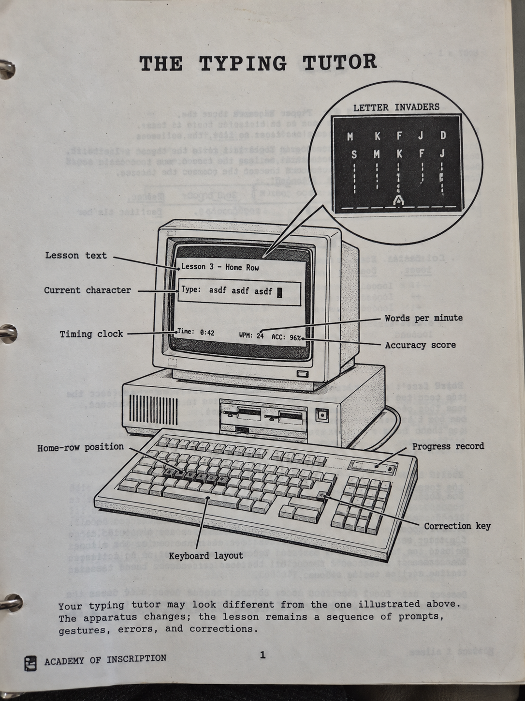

# Stylometrics

This repository is a research corpus containing essays, mathematical
models, source documents, illustrations, audio renderings, transcripts,
and computational experiments concerned with stylometry, inference,
epistemic proxies, representation, mathematical modeling, and related
formal frameworks.

A recurring concern across the collection is the relationship between an
observable feature and the hidden process inferred from it. Stylometric
markers, mathematical quantities, probability estimates, interface states,
and textual forms can all become proxies for processes that are not
themselves directly observed.

## Principal works

**Architectures of Permeability** examines representational forms and media
as active cognitive structures, particularly the distinction between useful
enclosure and systems that cease to admit effective external correction.

**Arranged Conditions** examines how explanatory conclusions depend upon
the conditions, reference classes, and causal arrangements supplied around
an observation.

**P(doom)** is a mathematical and satirical investigation of technological
catastrophe estimates, reference classes, priors, anthropic observation,
causal assumptions, and the sensitivity of apparently quantitative
probabilities to modeling choices.

**Roots of Optimism** develops a formal treatment of optimism through
repair, recoverability, continuation, and accessible future states rather
than treating optimism simply as an expectation of favorable outcomes.

**Stylometric Proxies** examines textual surface features used as proxies
for authorship, particularly attempts to identify machine-generated writing
from stylistic markers. It considers proxy formation, Goodhart effects,
adaptation, false positives, and the eventual decoupling of a public test
from the latent property it was intended to measure.

**SpherePOP Desktop** contains work relating the SpherePOP framework to
interface-level and desktop representations.

**Typing Tutors** contains historical and theoretical work on typing
instruction, paper-mediated tutoring systems, software tutors, and changes
in the pedagogical unit of action.

## Computational and visual material

The repository contains Python models, LaTeX tables and figures, cover
artwork, illustrations, and processing utilities associated with the
written research.

Visual artifacts are retained alongside their corresponding theoretical
work because presentation and representation form part of the research
process rather than a wholly separate publication layer.

## Audio corpus

Some works have spoken versions accompanied by transcripts and timing
information. These may appear as families of MP3, TXT, SRT, VTT, TSV, and
JSON files.

Current audio-related material includes the
`Optimism_is_the_math_of_repair` and
`Why_mathematical_models_hide_the_truth` artifact families.

## File types

LaTeX source is stored as `.tex`, compiled documents as `.pdf`,
computational material as `.py`, utilities as `.sh`, artwork as `.png`,
audio as `.mp3`, transcripts as `.txt`, `.srt`, and `.vtt`, timing data as
`.tsv`, and structured metadata as `.json`.

Generated LaTeX working files are intentionally excluded from version
control.

## Monotonic history

The initial Git history is deliberately constructed one file at a time.

Every initial commit introduces exactly one previously untracked path.
Consequently, the repository grows monotonically during its initial import:
no initial commit modifies or removes an artifact introduced by an earlier
commit.

Files are grouped loosely by function so that source material,
computational work, tooling, artwork, compiled documents, audio,
transcripts, and metadata occupy recognizable regions of the initial
history.

This ordering describes repository assembly rather than the historical
order in which the underlying works were authored.

## Building

A typical LaTeX document can be compiled with:

    latexmk -xelatex document.tex

Individual documents may have additional dependencies.

## Status

This is an active research corpus rather than a versioned software release.
Artifacts may represent finished essays, active drafts, computational
experiments, source material, generated representations, or intermediate
theoretical formulations.

The collection forms part of the broader Flyxion / Galactromeda research
corpus.

